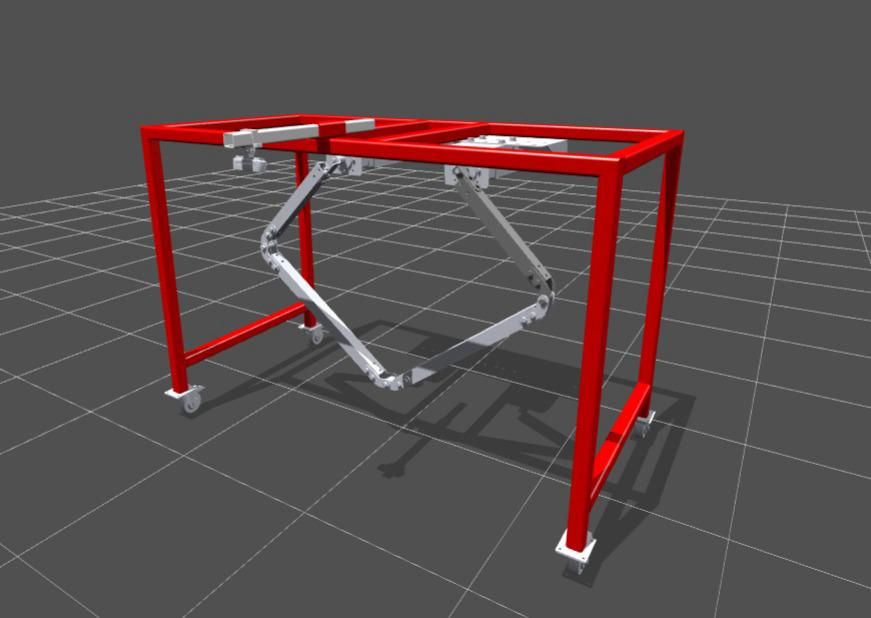

# Volcaniarm Workspace

ROS 2 workspace for the Volcaniarm, a 2-DOF delta type robotic arm for precision weeding in agriculture, as part of my Thesis.

<p align="center">
  
</p>

---

## Requirements

- Ubuntu 24.04
- ROS 2 Jazzy


## Packages

| Package | Description |
|---------|-------------|
| `volcaniarm_bringup` | Launch files (sim + real) |
| `volcaniarm_calibration` | Hand-eye calibration |
| `volcaniarm_controller` | Trajectory & Policy-based controllers (ros2_control) |
| `volcaniarm_description` | URDF, meshes, worlds, RViz configs |
| `volcaniarm_hardware` | Hardware interface, serial to MCU (ros2_control) |
| `volcaniarm_msgs` | Custom srv/msg definitions |
| `volcaniarm_motion` | Motion planning and kinematics |
| `volcaniarm_weed_detector` | Weed detection algorithm |

`easy_handeye2` and `apriltag_ros` are included as git submodules. `onnxruntime_vendor` is a local vendor package wrapping the prebuilt ONNX Runtime as part of policy-based controller.

## Setup

```bash
mkdir -p <your_ws_path>/volcaniarm_ws
cd <your_ws_path>/volcaniarm_ws
git clone --recurse-submodules git@github.com:LevinTamir/volcaniarm_ws.git .
```

## Build

```bash
colcon build --symlink-install
source install/setup.bash

# Simulation
ros2 launch volcaniarm_bringup sim_bringup.launch.py

# Real robot
ros2 launch volcaniarm_bringup real_bringup.launch.py
```

### Related repos
- Firmware: [volcaniarm_firmware](https://github.com/LevinTamir/volcaniarm_firmware)
- Isaac Lab: [volcaniarm_isaaclab](https://github.com/LevinTamir/volcaniarm_isaaclab)
