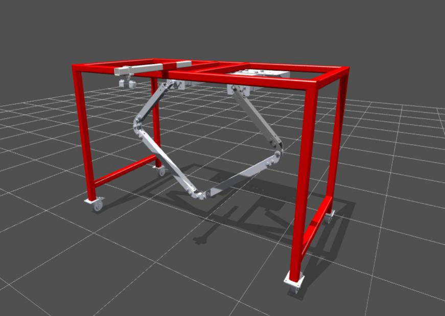

# Volcaniarm Workspace

ROS 2 workspace for the Volcaniarm, a 2-DOF delta type robotic arm for precision weeding in agriculture, as part of my Thesis.

<p align="center">
  
</p>

---

## Requirements

- Ubuntu 24.04
- ROS 2 Jazzy
- `python3-vcstool`
- `ros-jazzy-depth-image-proc` (shared pointcloud composer)
- `ros-jazzy-moveit` (only for `moveit:=true`)

## Packages

| Package | Description |
|---------|-------------|
| `volcaniarm_bringup` | Launch files (sim + real) + the shared colored-pointcloud composer |
| `volcaniarm_calibration` | Camera-pose calibration (dashboard, EE-sweep runner, tests) |
| `volcaniarm_controllers` | Trajectory, RL policy & RL vision-policy controllers (ros2_control) + joystick teleop |
| `volcaniarm_description` | URDF/xacro, meshes, Gazebo worlds, RViz configs |
| `volcaniarm_hardware_interface` | ros2_control hardware interface, serial to the ESP32 (udev rule included) |
| `volcaniarm_kinematics` | Analytic 5-bar FK/IK C++ library + pybind module (single source of truth) |
| `volcaniarm_moveit_config` | MoveIt phantom-chain planning config (move_group, SRDF, MotionPlanning RViz) |
| `volcaniarm_weed_detector` | Weed detection + targeting pipeline |

Third-party / vendor packages are pulled into `src/` via [vcstool](https://github.com/dirk-thomas/vcstool) and gitignored from this repo:

| Package | Source |
|---------|--------|
| `apriltag_ros` | https://github.com/christianrauch/apriltag_ros (pinned) |
| `onnxruntime_vendor` | https://github.com/LevinTamir/onnxruntime_vendor (prebuilt ONNX Runtime, used by the policy-based controller) |

## Setup

```bash
mkdir -p <your_ws_path>/volcaniarm_ws
cd <your_ws_path>/volcaniarm_ws
git clone git@github.com:LevinTamir/volcaniarm_ws.git .

# Install vcstool and pull third-party packages
sudo apt install python3-vcstool
vcs import < third_party.repos

# Install rosdep deps
rosdep install --from-paths src --ignore-src -ry
```

### Real Hardware

The hardware interface expects the ESP32 at `/dev/volcaniarm`. Plug in the ESP and run the installer once: it auto-detects the device's serial number, fills in the udev rule, and reloads udev.

```bash
cd <your_ws_path>/volcaniarm_ws
src/volcaniarm_hardware_interface/udev/install.sh
```

To remove: `src/volcaniarm_hardware_interface/udev/install.sh --uninstall`.

## Build

Build and source:

```bash
cd <your_ws_path>/volcaniarm_ws
colcon build --symlink-install
source install/setup.bash
```

Simulation:

```bash
ros2 launch volcaniarm_bringup sim_bringup.launch.py
```

Real robot:

```bash
ros2 launch volcaniarm_bringup real_bringup.launch.py
```

> **Note:** Common launch args (run with `--show-args` for the full list):
> - **sim**: `sim:=gazebo/isaac` (isaac auto-starts the Isaac Sim GUI with the lab
>   stage; `isaac_gui:=false` attaches to a running one), `controller:=traj/policy/vision_policy/all`,
>   `world_name:=<name>`, `calibration:=true/false`, `moveit:=true/false`, `pointcloud:=true/false`
> - **real**: `controller:=traj/policy/all`, `auto_home:=true/false` (or home later via the
>   `/volcaniarm_hardware_interface/home` service), `calibration:=true/false`, `moveit:=true/false`

Joystick EE teleop (works against sim or real — hold RB, drive the left stick;
RB+X homes; Jazzy's SDL joy_node maps RB=10/X=2):

```bash
ros2 launch volcaniarm_controllers joystick_teleop.launch.py use_sim_time:=true   # sim
ros2 launch volcaniarm_controllers joystick_teleop.launch.py                      # real
```

The camera pipeline is identical on every backend: the RealSense driver, the
Gazebo `rgbd_camera`, and Isaac Sim's bridge all publish D435i-matched color +
aligned-depth images, and one shared `depth_image_proc` composer
(`volcaniarm_bringup/launch/camera_pointcloud.launch.py`) builds the colored
`/camera/depth/color/points` from them.

`scripts/grab_camera_frames.py` captures raw frames from the running stack —
the capture side of the real-frame green-mask validation loop
(`check_mask_on_frames.py` in the isaaclab repo consumes them).

## Updating third-party packages

```bash
# Pull latest on every third-party repo
vcs pull src

# Refresh pinned versions in third_party.repos
vcs export src --exact > third_party.repos
```

### Related repos
- Firmware: [volcaniarm_firmware](https://github.com/LevinTamir/volcaniarm_firmware)
- Isaac Lab: [volcaniarm_isaaclab](https://github.com/LevinTamir/volcaniarm_isaaclab)
- ONNX Runtime vendor: [onnxruntime_vendor](https://github.com/LevinTamir/onnxruntime_vendor)
